# ColorMC用户指南

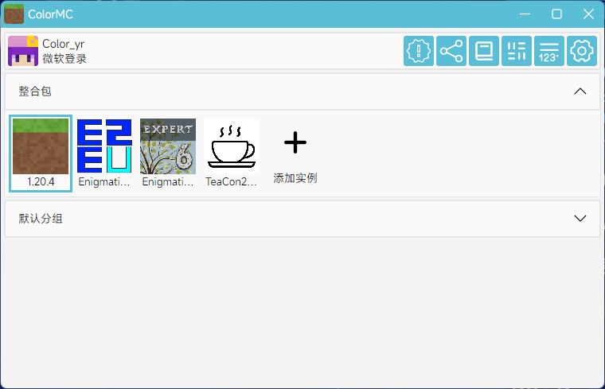

更新时间为2024.1.31，适用启动器版本A24

## 关键功能

- [添加游戏实例](#添加游戏实例页面)
- [添加资源](#添加资源页面)
- [账户管理](#账户页面)
- [游戏设置](#修改游戏实例页面)
- [启动器设置](#启动器设置页面)
- [服务器实例](#服务器实例)
- [云同步](#实例云同步页面)
- [原生手柄控制](#手柄设置)
- [联机大厅](#映射大厅页面)
- [角色皮肤](#角色皮肤页面)
- [游戏统计](#游戏统计页面)

## 详细目录

- [获取二进制文件](#获取二进制文件)
- [启动启动器](#启动启动器)
- [启动器相关概念](#启动器相关概念)
  - [启动器目录说明](#启动器目录说明)
  - [游戏实例](#游戏实例)
  - [服务器实例](#服务器实例)
  - [云同步实例](#云同步实例)
  - [游戏账户](#游戏账户)
  - [启动器初始界面](#启动器初始界面)
- [主页面](#主页面)
  - [游戏实例操作](#游戏实例操作)
- [账户页面](#账户页面)
- [添加游戏实例页面](#添加游戏实例页面)
  - [从其他启动器导入游戏实例](#从其他启动器导入游戏实例)
- [在线整合包页面](#在线整合包页面)
- [修改游戏实例页面](#修改游戏实例页面)
  - [版本设置](#版本设置)
  - [启动参数](#启动参数)
  - [模组列表](#模组列表)
  - [地图列表](#地图列表)
  - [资源包](#资源包)
  - [游戏内截图](#游戏内截图)
  - [服务器列表](#服务器列表)
  - [光影包](#光影包)
  - [结构文件](#结构文件)
- [配置文件页面](#配置文件页面)
  - [NBT修改](#NBT修改)
- [游戏实例日志页面](#游戏实例日志页面)
- [游戏实例导出页面](#游戏实例导出页面)
- [服务器实例生成页面](#服务器实例生成页面)
- [启动器设置页面](#启动器设置页面)
  - [Live2D人物显示](#Live2D人物显示)
  - [网络设置](#网络设置)
  - [启动设置](#启动设置)
  - [Java路径](#Java路径)
  - [客户端定制](#客户端定制)
  - [配置文件](#配置文件)
  - [手柄设置](#手柄设置)
  - [关于](#关于)
- [添加资源页面](#添加资源页面)
- [游戏统计页面](#游戏统计页面)
- [角色皮肤页面](#角色皮肤页面)
- [映射大厅页面](#映射大厅页面) 
- [实例云同步页面](#实例云同步页面)
- [游戏内覆盖页面](#游戏内覆盖页面)

## 获取二进制文件

获取启动器二进制文件有3种方式

1. 从Github publish中获取  
打开[ColorMC仓库](https://github.com/Coloryr/ColorMC)  
然后点击[Releases](https://github.com/Coloryr/ColorMC/releases)  
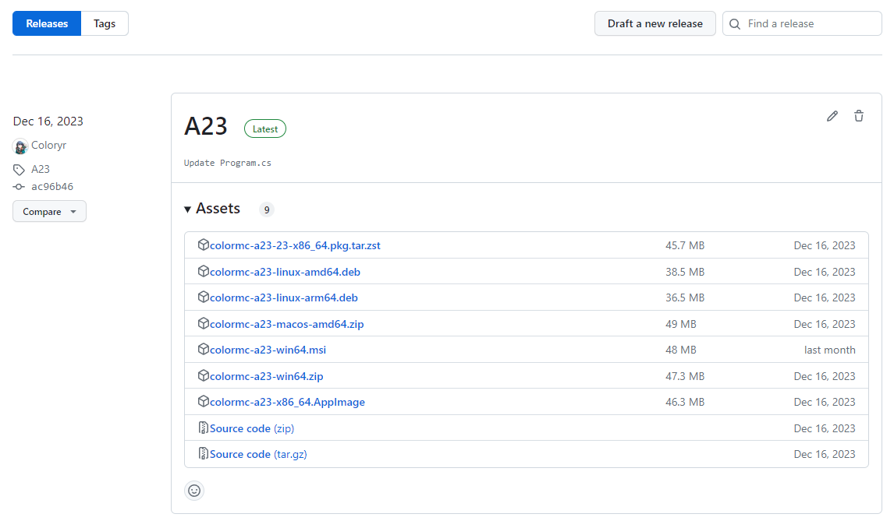  
或者点击[Actions](https://github.com/Coloryr/ColorMC/actions)  
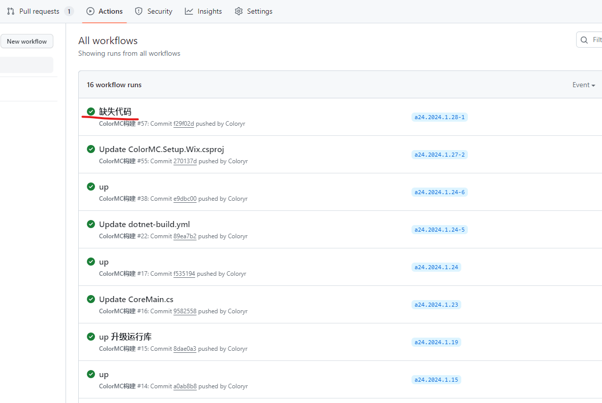  
选择最新的构建，或者老一点的构建，然后滑动到最下方，可以找到文件列表  
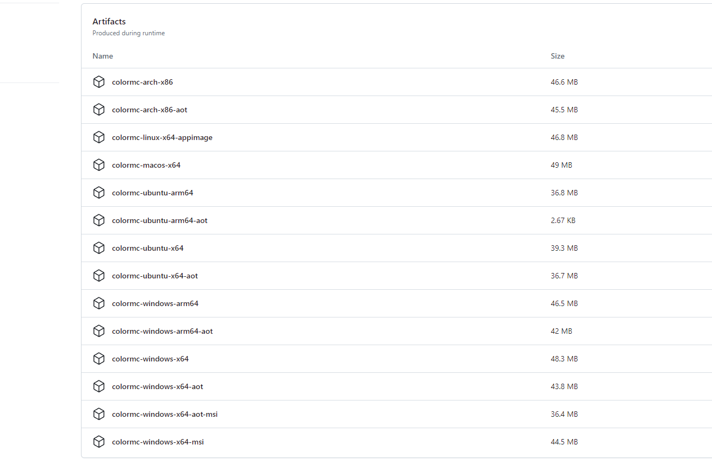  

然后根据你的电脑系统选择下载
- windows系统下载win64
- linux系统.deb .pkg.tar.zst .AppImage
- macOs系统下载osx64

**Releases里面的一般是正式发布版**  
**Actons里面的一般是测试版**

2. 从其他地方下载
加入群[571239090](http://qm.qq.com/cgi-bin/qm/qr?_wv=1027&k=iFEiL7JvAbPmM2E351SJlFk4UAHLx2yD&authKey=wyHTk7JbF8B47XYhvAQKmOcGTy3FQ%2FYA62hygi3J1x0KmZsfrlV%2B%2BK0iSyuxn3k1&noverify=0&group_code=571239090)
从群文件下载  
从[网盘](https://www.123pan.com/s/Nh4zVv-BjOAH.html)下载

3. 从源码里面构建  
参见[构建指南](https://github.com/Coloryr/ColorMC/blob/master/README.md#%E4%BB%8E%E6%BA%90%E7%A0%81%E6%9E%84%E5%BB%BA)

## 启动启动器

- windows和macOs系统，解压即可双击启动
- 若你是从msi安装包安装的，查找桌面的启动器图标，双击即可启动
- Linux系统安装包后可以在桌面或菜单中直接启动
- AppImage可以在Linux上直接启动

第一次启动启动器，若出现欢迎界面，则正常启动
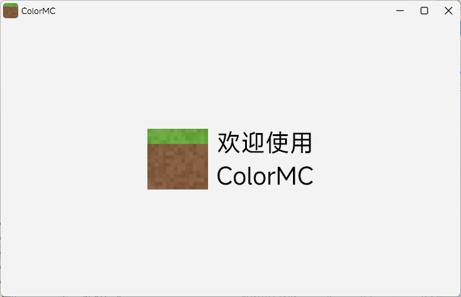  

若你将启动器安装在没有权限的目录下面，启动后出现  
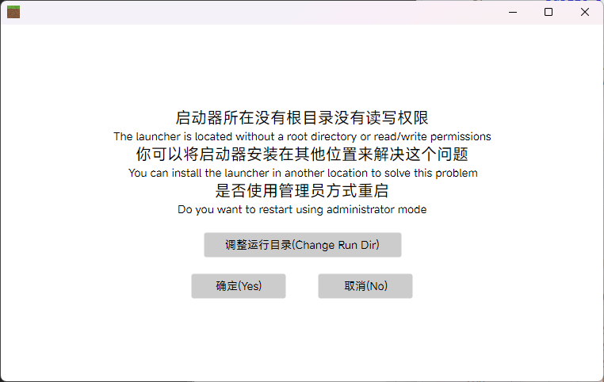  
请尝试将启动器安装在其他地方，或者根据上面的提示进行操作

## 启动器相关概念

在正式使用启动器之前，你需要了解一些概念性的东西  
能够更好的帮助你使用启动器

### 启动器目录说明

- Windows系统下，游戏默认存会在启动器根目录下  
账户储存会放在`C:\Users\{User}\AppData\Roaming\ColorMC`
- Linux系统下，游戏默认存会放在`~/ColorMC`  
账户储会放在`~/.config/ColorMC`
- macOs系统下，游戏默认放在`/Users/shared/ColorMC`  
账户储存会会放在`/Users/{User}/ColorMC`

游戏存储路径可以后期修改，但是账户储存路径固定不可修改

启动器启动后会创建如下的文件夹结构  
- dll         启动器更新
- download    下载缓存
- frp         端口映射二进制文件储存
- image       图片缓存
- inputs      手柄配置方案储存
- java        下载的Java储存
- minecraft   游戏文件储存
  - assets         游戏资源文件
  - instances      游戏实例
  - libraries      游戏运行库
  - versions       游戏版本信息储存
- tools         工具文件夹
- cloud.json    云同步储存
- config.json   核心配置文件
- count.dat     游戏统计储存
- frp.json      映射信息存储
- gui.json      GUI配置文件
- lock          启动器锁定
- logs.log      启动器日志
- maven.json    本地运行库信息
- temp          文件权限测试文件

在账户文件夹
- auth.json     账户储存
- run           启动器运行目录储存

### 游戏实例

ColorMC是`多实例`游戏启动器，启动器是以`游戏实例`为单位启动游戏  
`游戏实例`相当于一个独立的游戏配置  
启动器将Mod、配置、世界等储存在一个游戏文件夹，及放在一个游戏实例内  
使用多实例管理游戏可以将多个整合包放在一个启动器内统一管理，互不影响，但共享游戏资源文件和运行库，减少重复文件  
一个游戏实例只能运行一次，禁止多次同时运行后，因为可能会有干扰，损坏游戏文件等风险  
若需要运行多个相同的游戏实例，只能进行游戏实例复制多几份，单独运行  

### 服务器实例

用于客户端同步的特殊`游戏实例`，需要用一台服务器分发文件

### 云同步实例

将`游戏实例`放在服务器上的特殊`游戏实例`，云同步仅支持ColorMC的服务器与合作服务器商

### 游戏账户

ColorMC的启动游戏实例需要一个`账户`，账户可以是以下几种类型
- 离线账户
- 微软账户(OAuth登录验证)
- 统一通行证账户(Nide8)
- 外置登录(Authlib方式)
- LittleSkin皮肤站账户
- 自建皮肤站账户

账户至少会有以下数据
- 用户名(Username)
- 用户UUID(UUID)
- 账户类型(UserType)
- 客户端UUID(ClientUUID)

**启动器不会储存账户密码与游戏Token，但会储存更新Token**  
**使用离线账户来启动游戏时，至少登录一个正版账户**

### 启动器初始界面

启动器若没有游戏实例，则会显示初始界面  
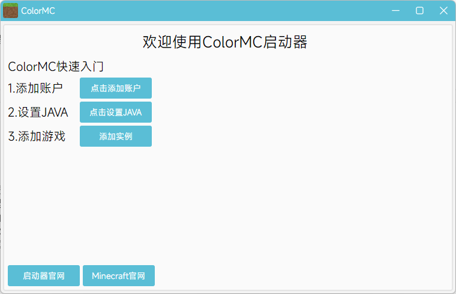  
在初始界面，你可以快速的进行账户添加、游戏运行时（JAVA）设置、添加游戏实例

## 主页面

启动器主页面中间会显示所有目前存在的游戏实例  
  

顶部右侧是菜单，点击按钮可以打开对应的窗口  
从右到左分别是`启动器设置` `游戏统计` `用户皮肤` `启动器用户手册` `映射大厅` `启动器更新日志`    
若启动器有新版本，则会在 `启动器更新日志` 左边显示一个 `启动器升级` 按钮

顶部左侧是当前使用的账户，点击头像可以打开账户设置窗口  

中间是游戏实例和游戏实例分组，所有游戏实例都在这里  
点击箭头可以让游戏实施分组最大化/最小化  
点击加号可以打开新建游戏实例页面，同时会设置游戏实例添加在该分组  

游戏实例分组内的每一个图标代表一个游戏实例，图标下面是游戏实例的名字  

若开启Live2D，会在游戏实例下方显示Live2D模型
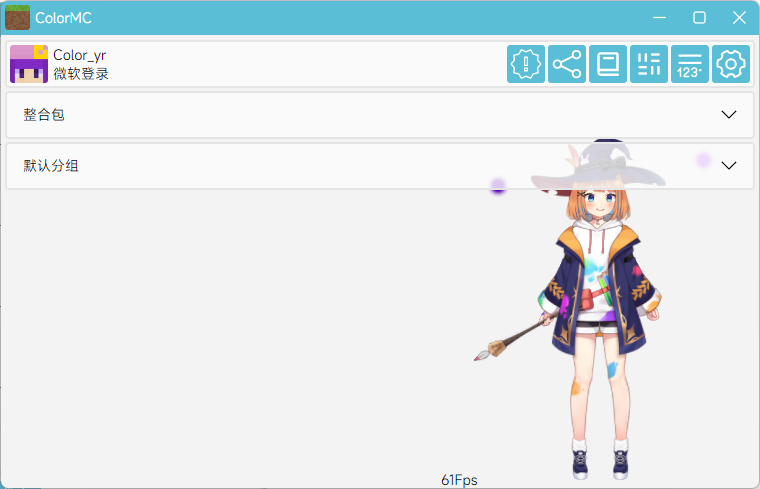  

启动器更新日志是联网进行获取的，可以在更新日志内查看近期与未来的计划  
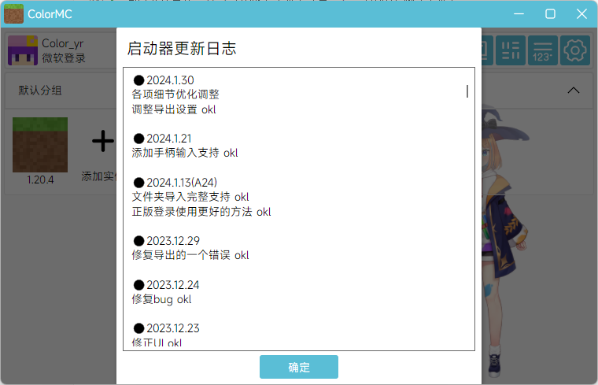  

启动器用户手册点开后会打开网页（即本网页）  
可以选择是在github（国外）上查看还是gitee（国内）网站上查看
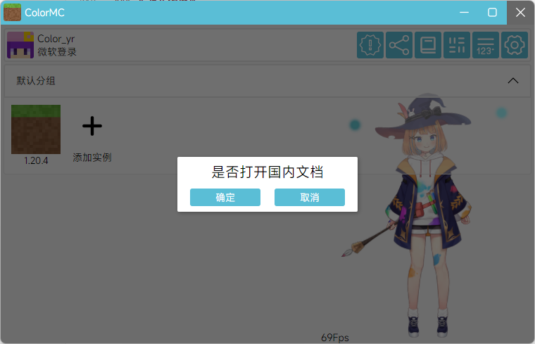  

### 游戏实例操作

点击游戏实例可以选择游戏实例  
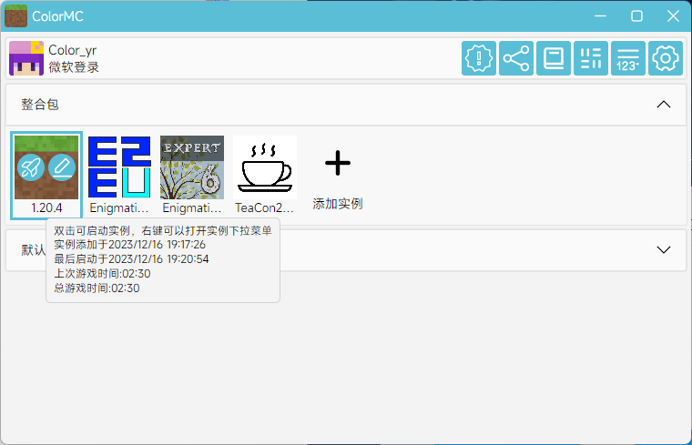  

鼠标放在游戏实例上可以显示相关操作，启动和修改实例，点击右键可以呼出实例菜单  
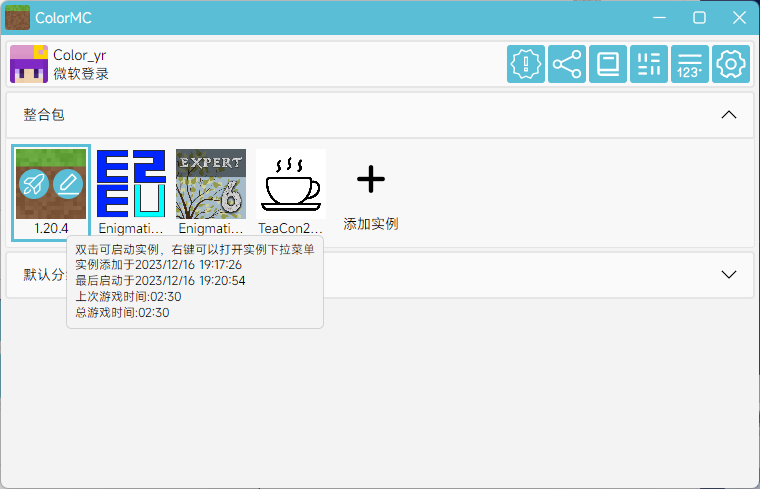  
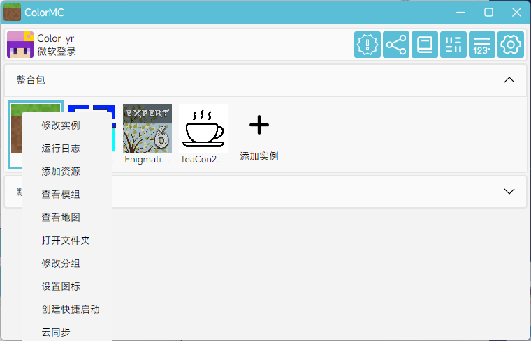  

选择好需要启动的游戏实例  
可以点击火箭按钮启动，又或者双击需要启动的游戏实例  
此时左上角会显示启动进度，右上角会有提示信息  
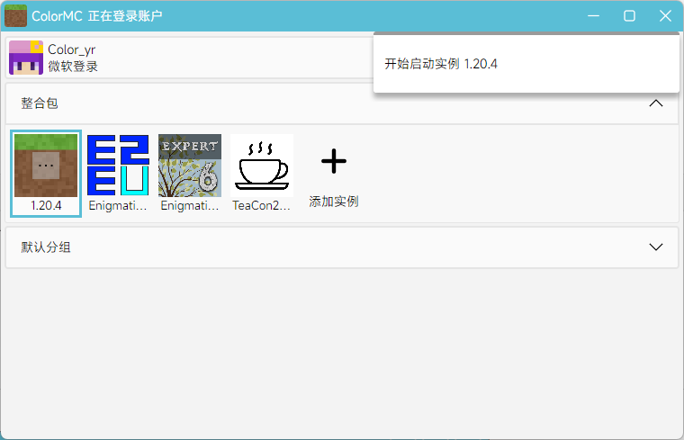  
则表示游戏实例正在启动中

点击旁边的修改按钮可以打开游戏实例设置页面  
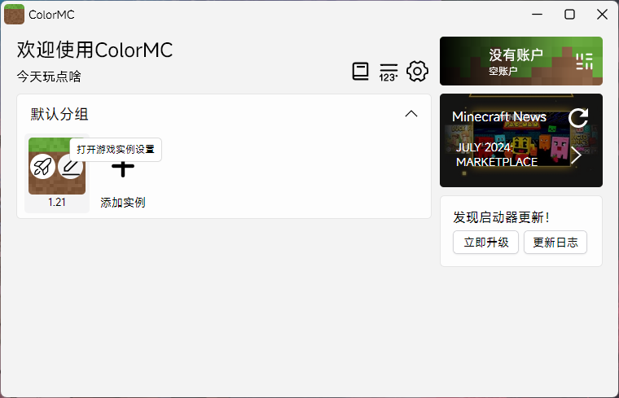  

## 账户页面

在主页面点击左上角的头像后，可以打开账户页面  
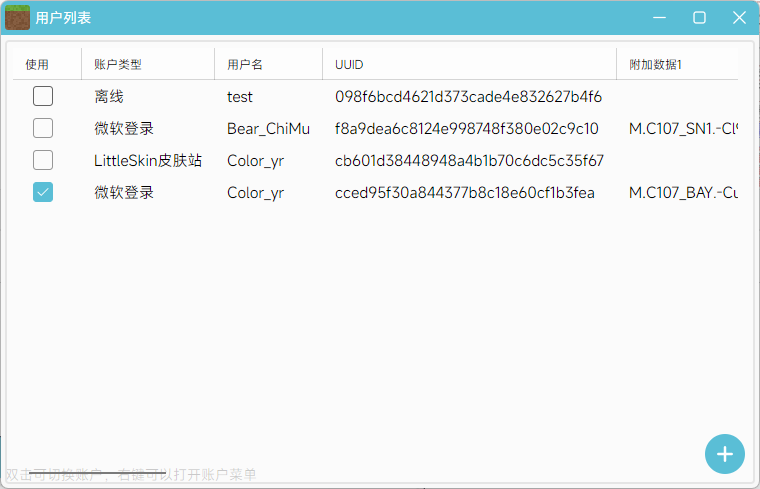

在该页面内，可以完成，账户的添加、删除、修改操作  
可以切换使用的账户，即启动游戏的账户

点击右下角的按钮，可以开始新建账户  
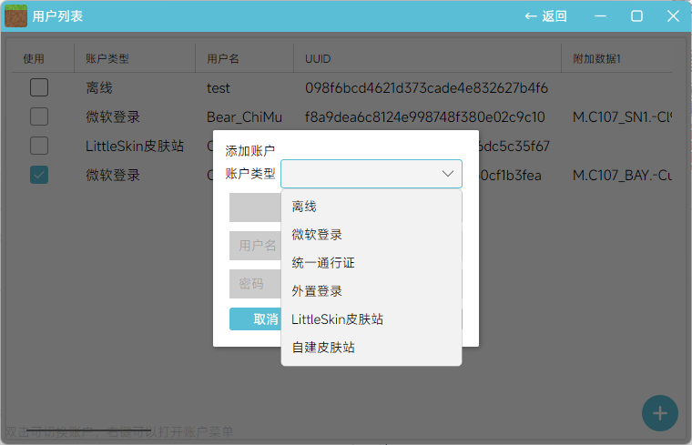

双击账户列表中的账户可以切换账户  
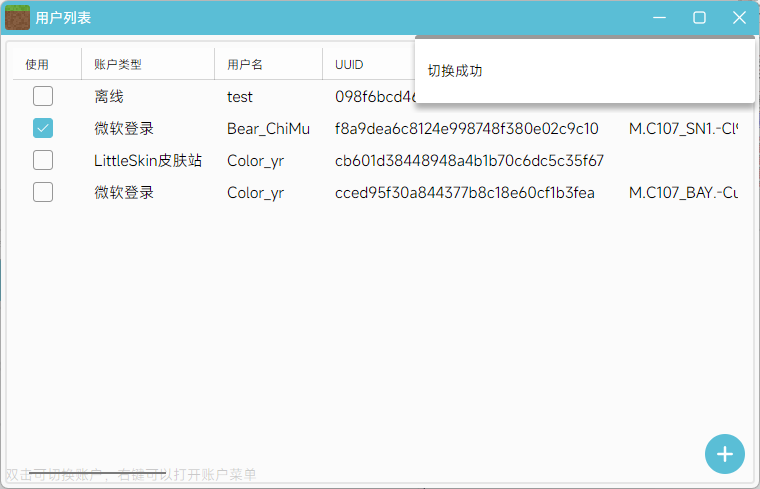

右键账户可以呼出菜单  
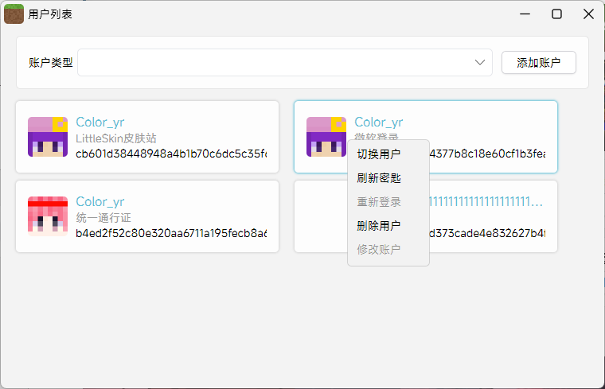

- 切换账户 切换使用的账户为此账户
- 刷新密钥 重新获取token
- 重新登录 重新输入密码登录
- 删除账户 删除储存的账户
- 修改账户 修改账户的名字或者UUID

## 添加游戏实例页面

点击主页面的`添加实例`，可以打开新建实例窗口  
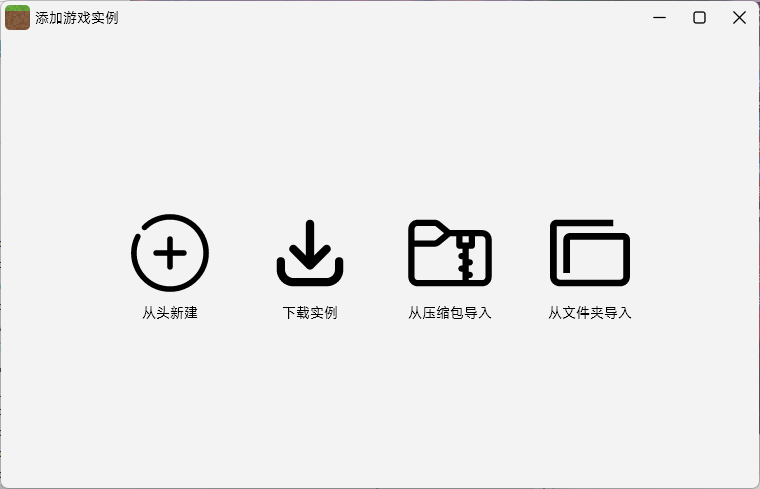

添加游戏实例有3种方式

- 新建实例  

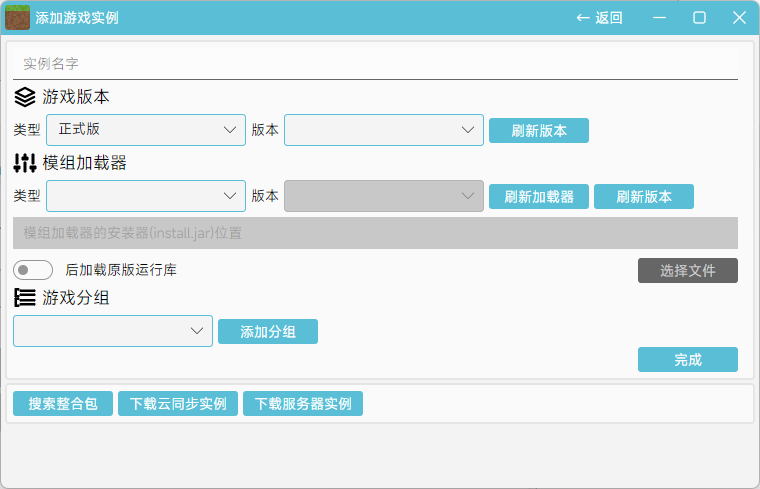  

空白新建:
只需要填写实例名字，选择版本等信息，最后点击右下角的`完成`按键即可添加  

点击`搜索整合包`可以打开 `在线整合包页面` 及在线下载整合包来添加实例  

下载云同步实例，点击 `下载云同步实例` 选择下载云同步的实例，[详情查看](#实例云同步页面)  
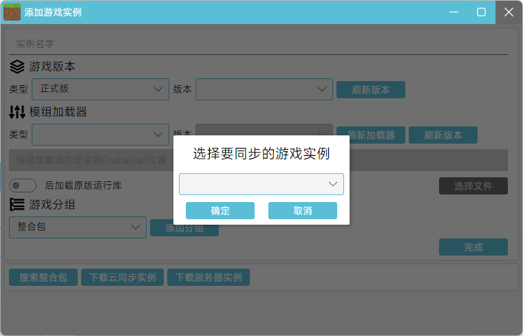  

下载服务器实例，点击 `下载服务器实例` 填入网址开始下载服务器实例，[详情查看](#服务器实例生成页面)  
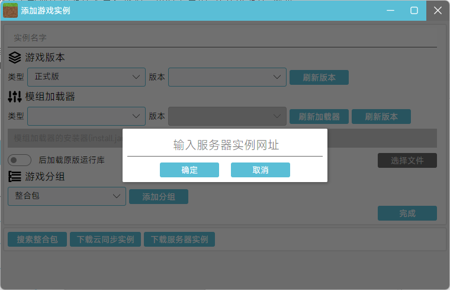  

- 从压缩包里导入实例  

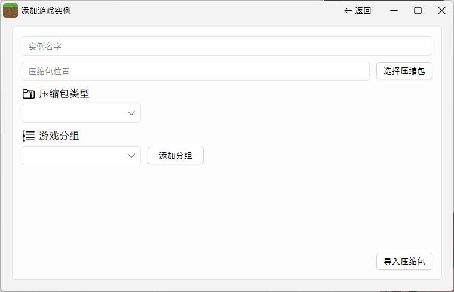  

从压缩包导入实例需要先选择压缩包，然后填写实例名字与选择压缩包类型，最后点击右下角的 `导入压缩包` 即可

- 从现有的文件夹导入实例  

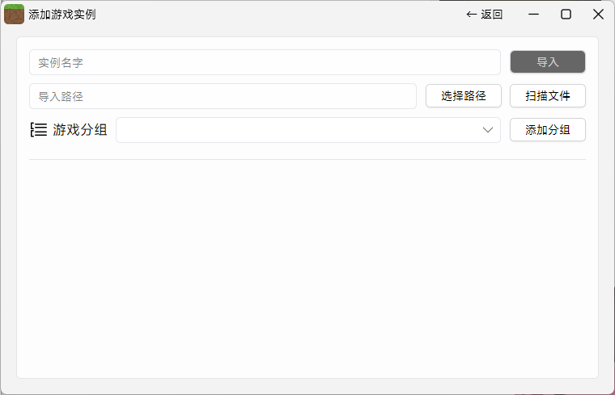  
从现有的文件夹导入实例需要先选择路径，然后填写实例名字，选择需要导入的文件内容，最后点击`导入`即可  
若导入后缺失版本信息，需要手动选择游戏版本

若你不想使用该方式添加游戏实例，可以点击右上角的 `返回` 回到上一个界面

### 从其他启动器导入游戏实例

`HMCL，PCL，BAKAXL` 等启动器格式  
在启动器选择 `新建实例-从文件夹导入` 选择 `.minecraft` 文件夹，点击开始导入后会自动搜索游戏版本自动导入

如果你导入 `MMC` 及其衍生启动器的游戏实例，则不需要导入文件夹，直接复制`instances`文件夹到ColorMC工作目录下的 `minecraft/instances` ，重启启动器即可

## 在线整合包页面

在添加实例的窗口内，点击`搜索整合包`可以打开窗口  
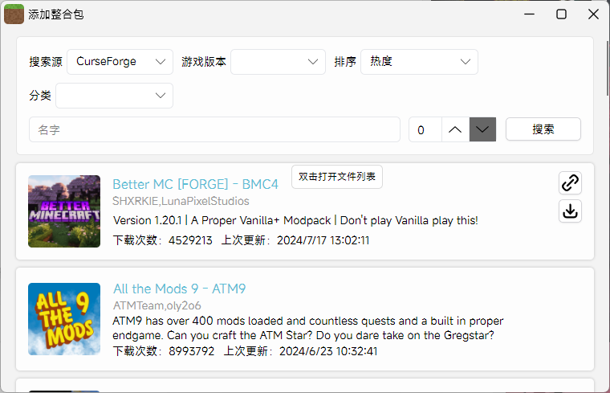  
可以在上方的选择中筛选整合包等  
双击一个整合包可以打开版本选择  
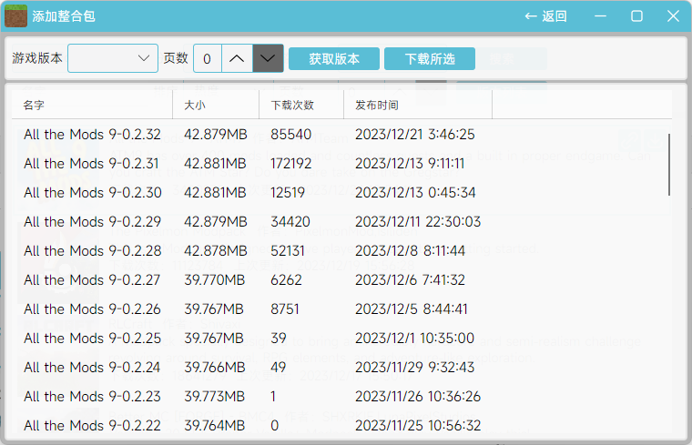  
再次双击可以开始下载整合包

若需要下载其他整合包，可以点击右上角返回关闭版本选择

在下载前若保持 `添加实例窗口` 开启  
整合包下载完成后会自动填入 `实例名字` 与 `游戏分组` 信息

## 修改游戏实例页面

从主页面选择游戏实例后，点击修改按钮或者，右键菜单选择 `修改实例` 即可打开修改游戏实例页面 
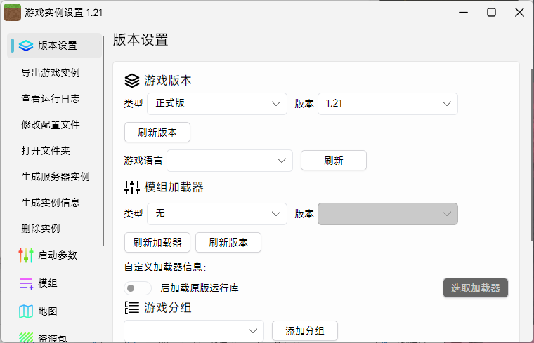  

点击上方 `版本设置` 或者其旁边的按钮 可以打开侧边栏  
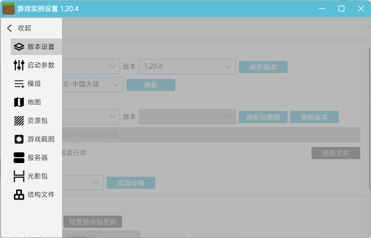  

### 版本设置  
设置游戏的版本，Mod加载器，整合包信息等
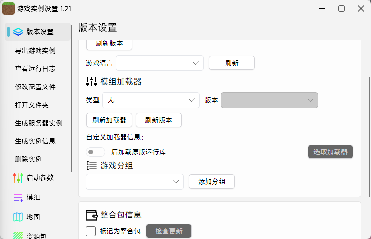  
可以检测整合包更新  
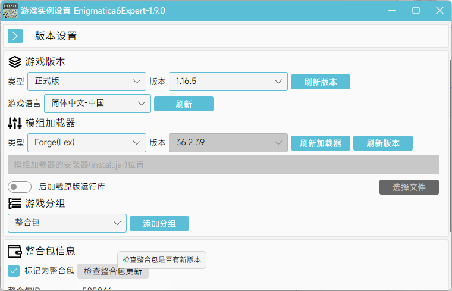  
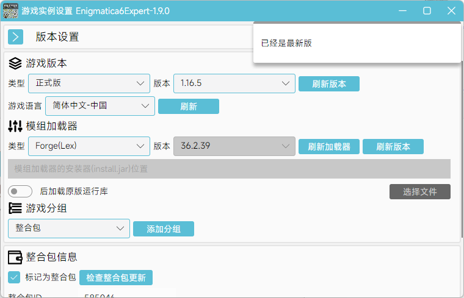  

下方还能进行游戏实例的其他操作以及打开其他窗口
- 删除  删除这个游戏实例
- 导出游戏实例  打开游戏实例导出页面
- 查看运行日志  打开游戏实例运行日志页面
- 修改配置文件  打开游戏实例配置文件页面
- 打开文件夹  在资源管理器查看游戏实例文件
- 生成服务器实例  打开游戏实例分发页面

### 启动参数  
设置游戏启动时使用的参数  
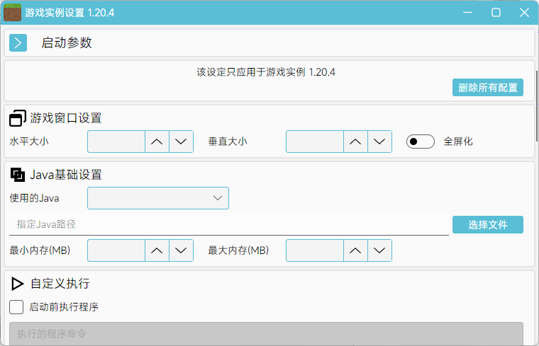  

可以设置的参数有
- 窗口大小设置 设置窗口初始启动大小
- Java设置 设置启动使用的Java与内存大小
- 自定义执行 设置启动前与启动后执行
- Jvm参数设置 设置Jvm与游戏具体的启动参数
- 自动加入服务器 设置游戏启动后自动加入的服务器
- 端口代理设置 设置游戏内联网的端口代理

**在该页面设置的参数只对该游戏实例生效**

### 模组列表  
可以查看游戏实例的模组  
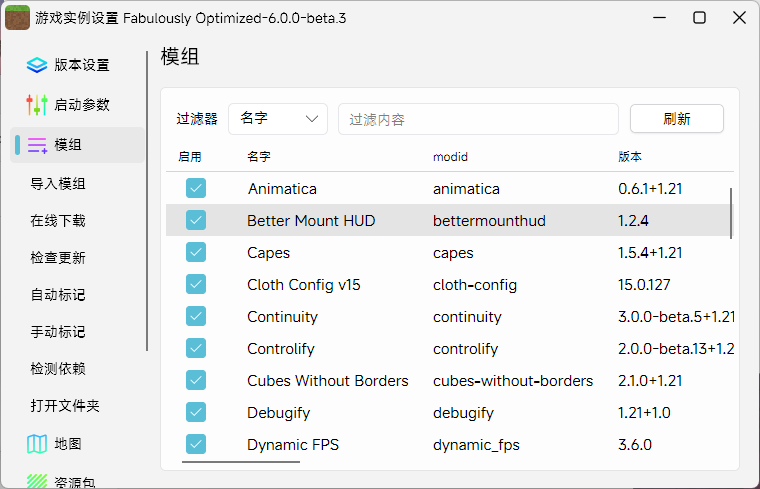  
同时有以下功能
- 自动检测modid冲突  
  
- 可以检测模组依赖\更新等  
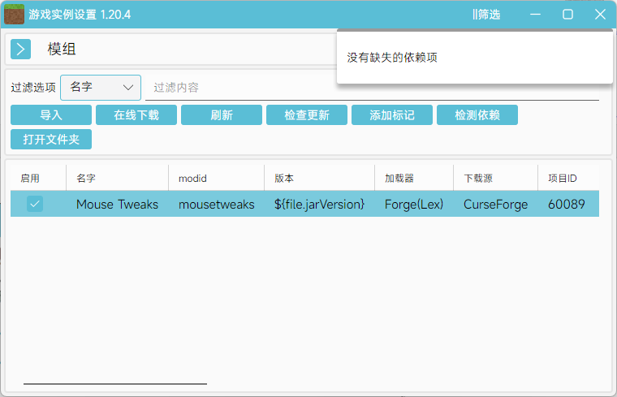  
- 检测标记的模组更新  
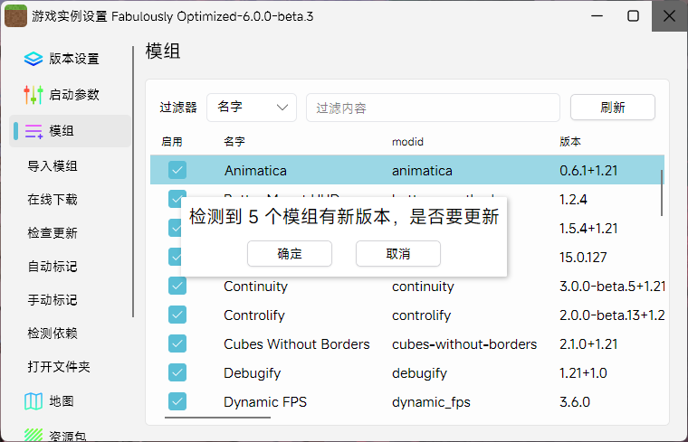  
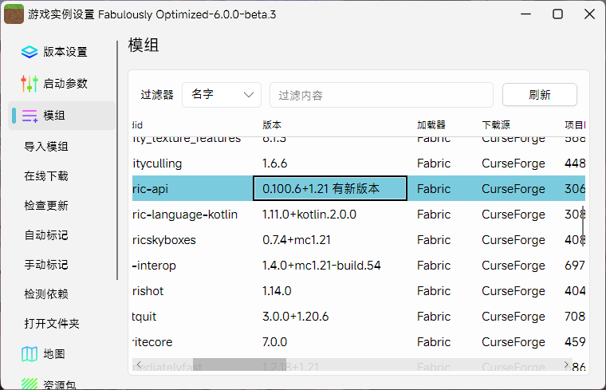  
- 双击模组项目可以`启用/禁用` 
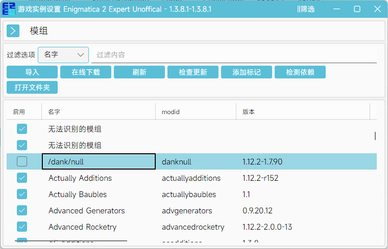  

筛选有4种过滤方式
- 名字 根据模组的名字过滤
- 文件名 根据现有的文件名过滤
- 作者 根据模组的作者名过滤
- modid 根据模组的唯一标识过滤

上方功能按钮
- 导入模组 从现有文件添加到游戏实例中
- 添加模组 打开资源下载页面，并选择模组下载
- 刷新 刷新列表
- 检测模组更新 检测有标记的模组是否有新版本
- 标记模组 用于标记模组所在的下载源项目ID与版本等
- 依赖检测 检测模组的前置是否齐全

可以拖拽 `jar文件` 到列表中来添加模组  

选择模组右键可以打开菜单  
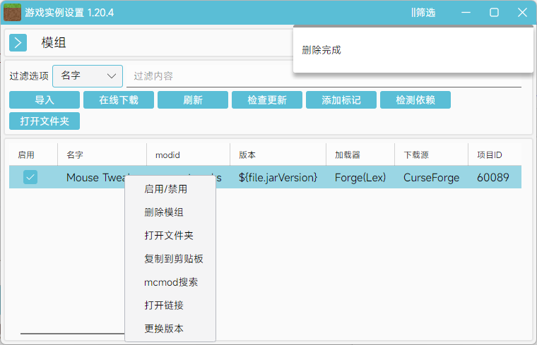  
按住`Shift键`可以多选模组，也可以右键打开菜单，进行操作  
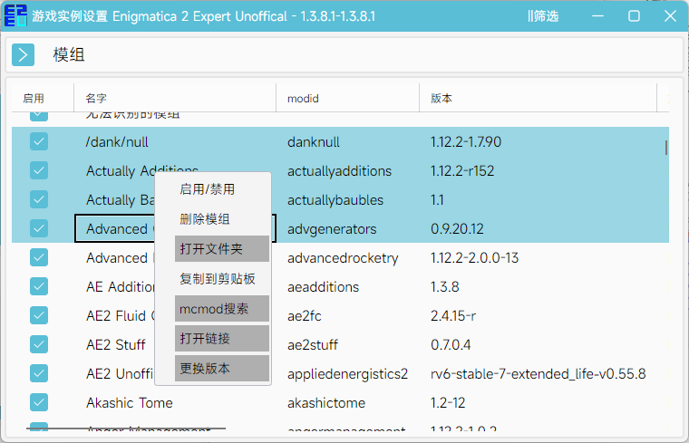  

**不是所有模组都能正确识别，有些coremod是无法识别出来的**

### 地图列表  
查看游戏实例的地图  
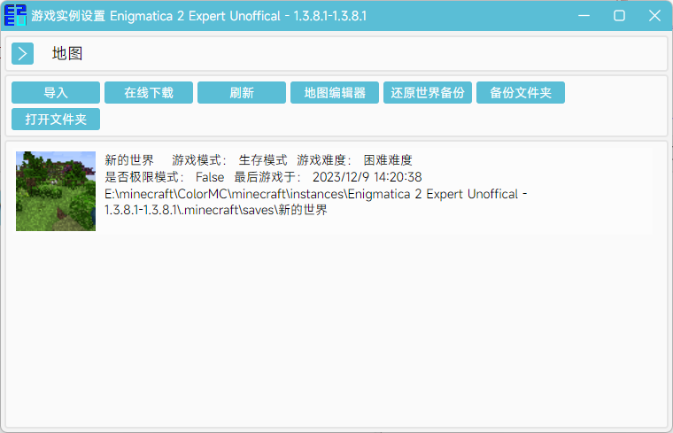  
选择世界后可以查看地图的数据包，对数据包可以可以进行修改操作  
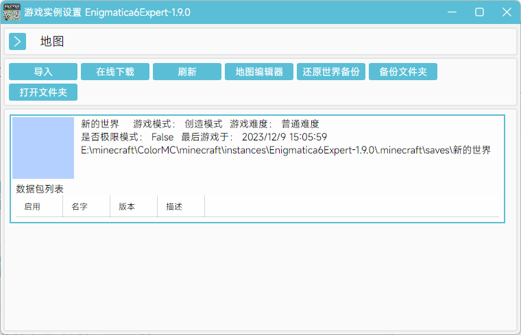  
右键可以打开菜单  
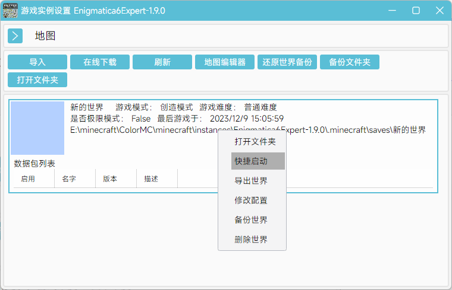  
点击修改配置可以打开 该地图的配置文件页面

### 资源包  
查看游戏实例的资源包  
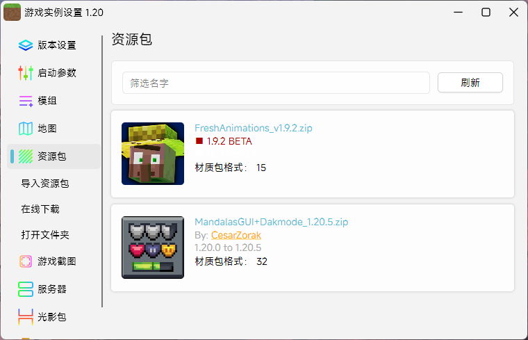  
右键可以打开菜单  
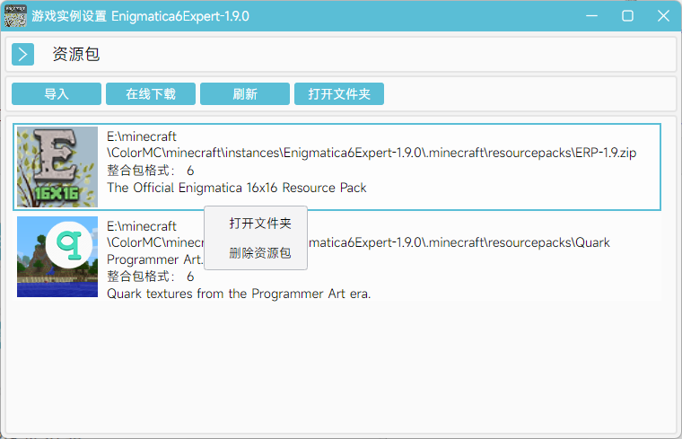  

### 游戏内截图  
查看游戏实例内的截图  
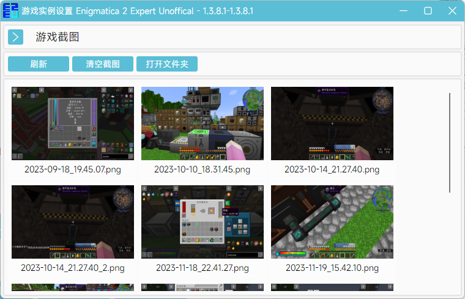  
右键可以打开菜单  
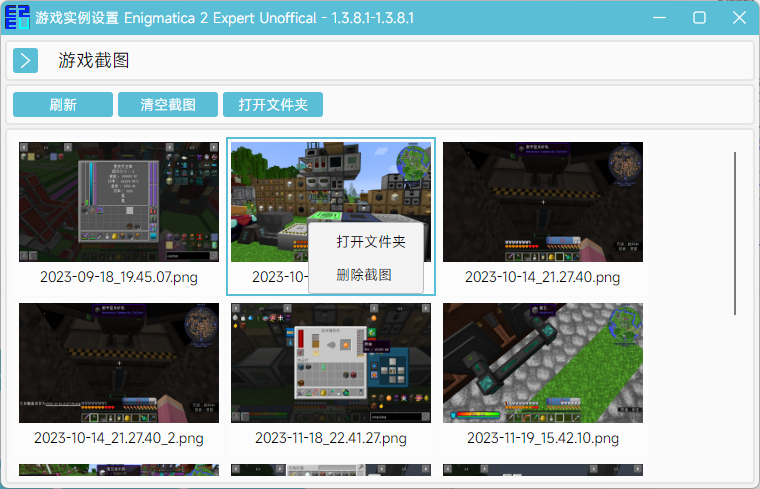  

### 服务器列表  
查看游戏实例的服务器列表  
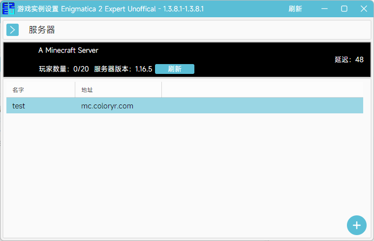  

选择一个服务器后会自动获取服务器显示信息  
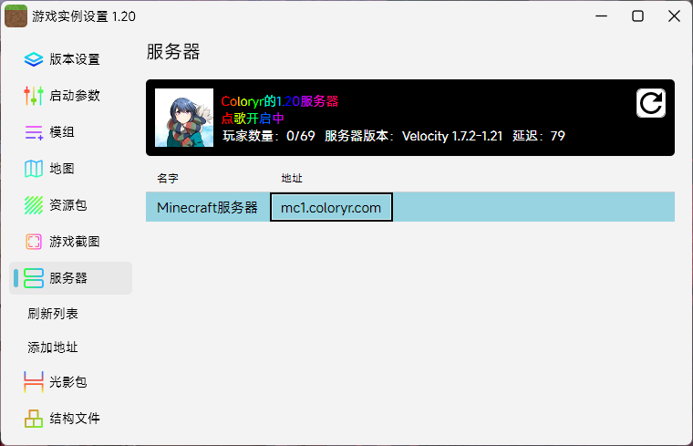  

右键可以打开菜单，右下角为添加新的服务器  
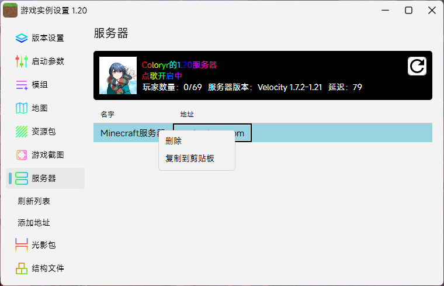  
  

### 光影包  
查看游戏实例的光影包(shaderpack)信息  


### 结构文件  
查看游戏实例的结构文件(schematics)，包括投影模组的结构文件  


## 配置文件页面

打开游戏实例设置窗口后，在版本设置的最下面点击 `修改配置文件` 按钮  
或在地图列表内右键世界点击 `修改配置` 按钮可以打开窗口  
打开窗口后可以查看\修改配置文件  
  
在左上角的选择框可以选择配置文件  
过滤器会选出名字包含的文件  
  

### NBT修改
内置有NBT修改器，若打开的是NBT格式文件，或地图文件，可以进行NBT修改  
  
  
NBT编辑器下，可以通过右键来打开菜单进行编辑  
  
地图查找模式下，可以进行方块或者实体的查找  
  
修改完配置文件后需要点击保存修改或按下快捷键`Com + S`才会保存

## 游戏实例日志页面

打开游戏实例设置窗口后，在版本设置的最下面点击 `查看运行日志` 按钮  
或在主界面右键实例点击`运行日志`按钮可以打开窗口  
  
该页面会加载所有`logs/`下的日志文件  
默认会显示启动器内最后运行产生的日志  
  

在上方选择后可以打开文件  
  
选择下面是功能按钮
- 测试启动 用于检测游戏启动时的日志信息  
- 强制停止 若游戏在运行中，你可以强制停止(Kill)游戏
- 刷新列表 重新加载日志列表
- 搜索 打开日志内容搜索
- 上传日志 上传当前日志信息到服务器，生成一个网页链接

**日志文本无法编辑，但是可以复制**

## 游戏实例导出页面

打开游戏实例设置窗口后，在版本设置的最下面点击`导出游戏实例`按钮  
或者在主页面内右击游戏实例，选择导出游戏实例可以打开该页面  

打开后可以选择导出类型  

点击头顶可以打开侧边栏

  

- ColorMC整合包 只能在ColorMC启动器内使用
- CurseForge整合包 用于主流启动器整合包
- Modrinth整合包 用于主流启动器整合包

可以设置模组在线下载  
  

设置了模组在线下载后，导出的整合包内可以不附带该mod，在导入时进行下载  
双击勾选可以 `选择/不选择` 该模组

**只有标记的模组支持该操作**

文件选择可以将所需文件放进压缩包内  
  

文件在线下载可以选择文件设置下载路径  
**仅Modrinth整合包支持**
  

**导出的CurseForge或Modrinth整合包，可以发布在其网站上**

## 服务器实例生成页面

打开游戏实例设置窗口后，在版本设置的最下面点击 `生成服务器实例` 按钮  
可以打开游戏服务器实例生成页面
  

点击上方 `总体设置` 或者其旁边的按钮 可以打开侧边栏
  

根据需要进行调整与选择文件  
  
如模组有标记，则会自动填充下载地址
  
  

最后生成服务器实例，会导出到一个文件夹  
  
你需要把这个文件夹内的东西放在服务器上，让客户端可以访问即可  
  

## 启动器设置页面

在启动器主页面点击设置按钮可以打开窗口 
  

点击上方 `页面设置` 或者其旁边的按钮 可以打开侧边栏  
  

### 界面设置

调节启动器界面显示等  
  
例如启动器的主题色，背景颜色  
启动器的字体，窗口透明方式等
  

### Live2D人物显示

往下拖动有`Live2D人物设置`选项  
  
在使用Live2D人物模型显示之前，需要先安装[Core](https://www.live2d.com/download/cubism-sdk/download-native/)  
将下载好的压缩包解压后，复制`dll`或`so`文件到启动器二进制根目录下
  
然后重启启动器  
再次打开设置页面找到`Live2D人物设置`，若能正确识别Core版本则安装成功  
然后就可以选择模型并加载  
模型只支持model3和moc3，不支持其他版本

**不同系统需要放的二进制文件不一样**  

在主界面显示人物后，可以点击人物进行互动，操作等  
  
右键可以呼出菜单  
  

### 网络设置  
调节启动器联网功能  
  

主要调节  
- 下载设置 调节游戏文件下载源，下载线程数等
- 代理设置 调节下载使用使用的端口代理
- 启动器更新 是否自动检测启动器更新
- 云同步密钥 用于启动器游戏实例云同步

**在文件下载过程中，不可修改下载与代理设置**

### 启动设置  

调节游戏启动参数等  
  

主要调节
- 是否在启动前检测完整性
- 游戏窗口大小
- Jvm游戏参数等
- 启动前，启动后运行

### Java路径  
调节游戏使用的的Java路径  
  

- 下载Java 可以打开Java下载页面
- 扫描并添加 尝试扫描电脑上存在的Java（非扫盘）
- 删除所有 删除所有Java路径
- 压缩包导入 导入一个压缩包到启动器内
- 刷新 刷新Javal列表
- 选择文件与添加 选择电脑上的Java路径并添加到列表中

选择一个Java路径，右击可以打开菜单

### 客户端定制  
给服主使用的定制功能  
  

可以进行定制设置  
- 锁定启动实例 玩家只能启动某个游戏实例  
- 锁定登陆模型 玩家只能以某种方式进行登录
- 自定义UI 导入自定义UI界面
- 自定义音乐 在启动器启动时循环播放音乐，支持网易云的音乐链接

自定义UI使用axaml格式，默认的模板为
```xml
<view:CustomPanelControl
    xmlns="https://github.com/avaloniaui"
    xmlns:x="http://schemas.microsoft.com/winfx/2006/xaml"
    xmlns:d="http://schemas.microsoft.com/expression/blend/2008"
    xmlns:mc="http://schemas.openxmlformats.org/markup-compatibility/2006"
    xmlns:view="clr-namespace:ColorMC.Gui.UI.Controls.Custom"
    xmlns:views="clr-namespace:ColorMC.Gui.UI.Controls"
    xmlns:views1="clr-namespace:ColorMC.Gui.UI.Controls.Items"
    Title="自定义标题"
    mc:Ignorable="d">
    <Panel>
        <StackPanel
            Margin="0,0,5,0"
            HorizontalAlignment="Right"
            VerticalAlignment="Bottom">
            <Button
                Width="100"
                Height="25"
                Margin="5,0,0,5"
                Command="{ReflectionBinding Launch}"
                Content="启动游戏" />
            <Button
                Width="100"
                Height="25"
                Margin="5,0,0,5"
                Command="{ReflectionBinding Setting}"
                Content="启动器设置" />
            <Button
                Width="100"
                Height="25"
                Margin="5,0,0,5"
                Command="{ReflectionBinding OpUrl}"
                CommandParameter="Https://www.baidu.com"
                Content="打开网页" />
            <Button
                Width="100"
                Height="25"
                Margin="5,0,0,5"
                Command="{ReflectionBinding User}"
                Content="编辑账户" />
            <Button
                Width="100"
                Height="25"
                Margin="5,0,0,5"
                Command="{ReflectionBinding Skin}"
                Content="查看皮肤" />
        </StackPanel>
        <TextBlock
            Margin="10"
            HorizontalAlignment="Left"
            VerticalAlignment="Bottom"
            Background="#FFEEEEEE"
            FontSize="20"
            Foreground="#FF000000"
            Text="xxx服务器专用客户端" />
        <views:ServerMotdControl Margin="5" IPPort="{ReflectionBinding Server}" />
        <views1:GameControl
            HorizontalAlignment="Center"
            VerticalAlignment="Center"
            DataContext="{ReflectionBinding Game}" />
        <StackPanel
            Margin="10,80,10,10"
            HorizontalAlignment="Right"
            VerticalAlignment="Top"
            Orientation="Vertical">
            <Image
                Width="80"
                Height="80"
                Margin="10,0,10,0"
                HorizontalAlignment="Center"
                Source="{ReflectionBinding Head}" />
            <TextBlock
                Margin="0,5,0,5"
                HorizontalAlignment="Center"
                Text="{ReflectionBinding UserName}" />
            <TextBlock
                Margin="0,5,0,5"
                HorizontalAlignment="Center"
                Text="{ReflectionBinding UserType}" />
        </StackPanel>
    </Panel>
</view:CustomPanelControl>
```
UI使用Avalonia的标准页面编写即可  
[AXAML](https://docs.avaloniaui.net/docs/next/basics/user-interface/introduction-to-xaml) [UI控件](https://docs.avaloniaui.net/docs/next/basics/user-interface/controls/builtin-controls)

### 配置文件  
启动器配置文件  
  

同时也可以打开相关的路径

**调整启动器工作目录只在特殊情况下使用，调整后文件不会自动复制，需要手动复制**

### 手柄设置

启动器支持手柄输入到游戏内，无需安装Mod即可体验游戏内手柄支持  
  
勾选游戏内手柄支持后，只要启动游戏都会采用 `游戏内覆盖页面` 来显示游戏  
只要是有驱动的手柄都能支持上  
手柄配置是按文件区分开来的，默认会使用`启用配置`里的手柄配置

手柄配置分为3个部分绑定
- 按键绑定 在手柄上按下该按键后就会执行对应绑定的按钮
- 扳机与摇杆绑定 可以在线性区内划分区域，绑定不同的按钮
- 摇杆绑定 指定视角与指针移动所用的摇杆

  
  
  

摇杆与扳机都可以设置死区，视角与光标可以设置其灵敏度  
上滚轮与下滚轮需要单独绑定在按键内  
  

**目前仅支持Windows平台**

### 关于  
启动器说明  
  

## 添加资源页面

打开游戏实例设置窗口后，在Mod列表，地图列表等点击左侧的`在线下载`按钮  
或在主界面右键实例点击`添加资源`按钮可以打开窗口  
  
打开窗口后会搜索资源
  
添加资源主要用于下载游戏资源，例如Mod，地图，材质包等  
  
搜索模组可以选择搜索源
  
在上方可以选择来筛选内容  
  
双击后打开版本列表，双击版本可以开始下载资源  
  

## 游戏统计页面

在主界面点击游戏统计，打开游戏统计窗口  
  
游戏统计会统计游戏的启动记录与运行时间  

## 角色皮肤页面

在主界面点击角色皮肤，打开角色皮肤查看窗口  
  

左侧为皮肤显示，右侧为功能选择等

在左侧的皮肤显示，可以修改模型显示角度 位置 大小  
- 鼠标左键并移动鼠标 或者点击 右边的上下左右 为旋转角色模型  
- 鼠标右键并移动鼠标 或者点击 左边的上下左右 为平移角色模型  
- 鼠标滚轮 或者点击 右侧的上下 为缩放角色模型

在右侧，可以修改皮肤模型，启用/关闭动画  
或者修改骨骼关节角度

## 映射大厅页面

点击映射工具可以打开窗口  
  
**打开映射工具需要选择正版账户，打开后会登录并验证正版账户**  
  

点击上面可以打开侧边栏

映射大厅会显示目前存在的映射
  

映射大厅可以开始映射，目前支持[NatFrp](https://www.natfrp.com/)与[OpenFrp](https://www.openfrp.net/)两个映射平台集成  
**如果你需要集成其他平台请联系我**

填写好`Key`后，刷新，可以看到隧道列表
  

然后启动游戏，开启局域网  
之后切换到`局域网游戏`

选择你需要映射的局域网

点击开始映射后选择隧道  

等待程序运行，完成后映射成功

如果你需要共享映射，点击右上方的共享映射即可

此时就能在映射大厅看到你的映射了

## 实例云同步页面

**启动云同步之前，需要在启动器设置的网络设置内配置正确的云同步密钥**  
在主界面选择一个游戏实例，右击选择`云同步`
  
即可打开云同步页面  
  

游戏实例需要`启用云同步`后才能正常使用

云同步主要同步，配置文件与地图  

配置文件只有一次上传，请确保整个游戏实例关键的文件都上传了  
若为整合包，且有标记的模组，则模组可以不需要上传，可以在启动前自动补全  
  

地图同步主要是根据存档来上传，每次上传只会更新修改的文件
  
右键存档可以打开菜单  
 

开启了云同步后，在添加游戏实例中，选择`下载云同步实例`  
此时可以选择下载云同步实例  
   

**已经在本地的游戏实例不会在此列表中展示**

**云同步密钥请不要泄漏，否则造成的文件丢失概不负责**  
**云同步会消耗云存储空间，超出后将无法写入文件，请适当使用**

## 游戏内覆盖页面

若启用了游戏内手柄支持，则会使用游戏内覆盖页面来显示游戏  
   

此时手柄指针会显示在游戏画面之上  
  

点击右上方的 `调整手柄` 可以调整设置
  
