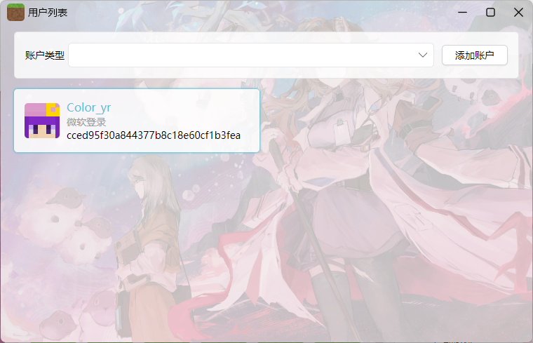
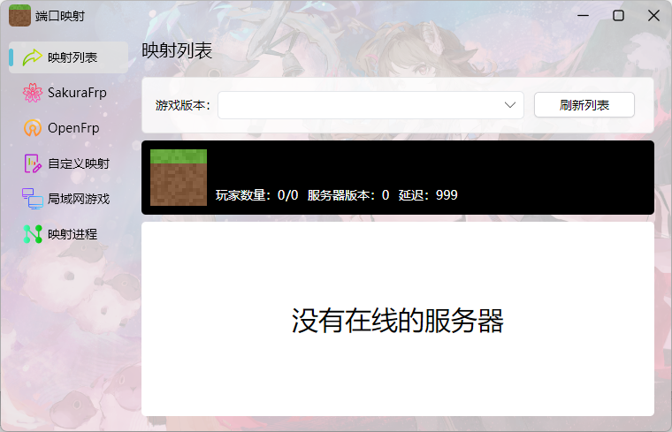
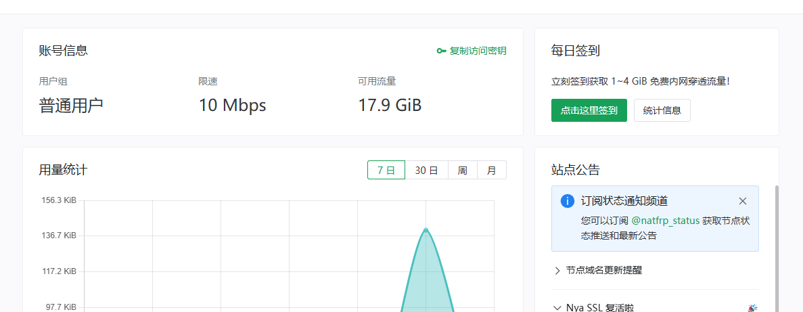
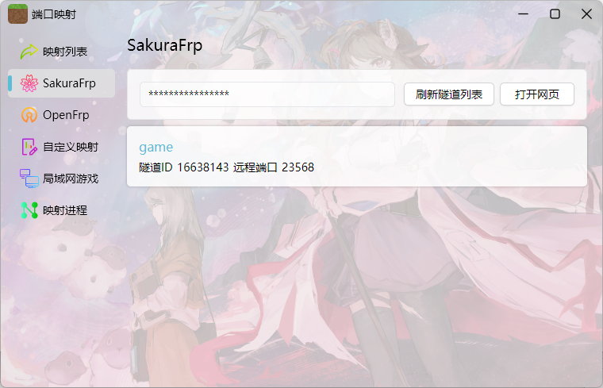
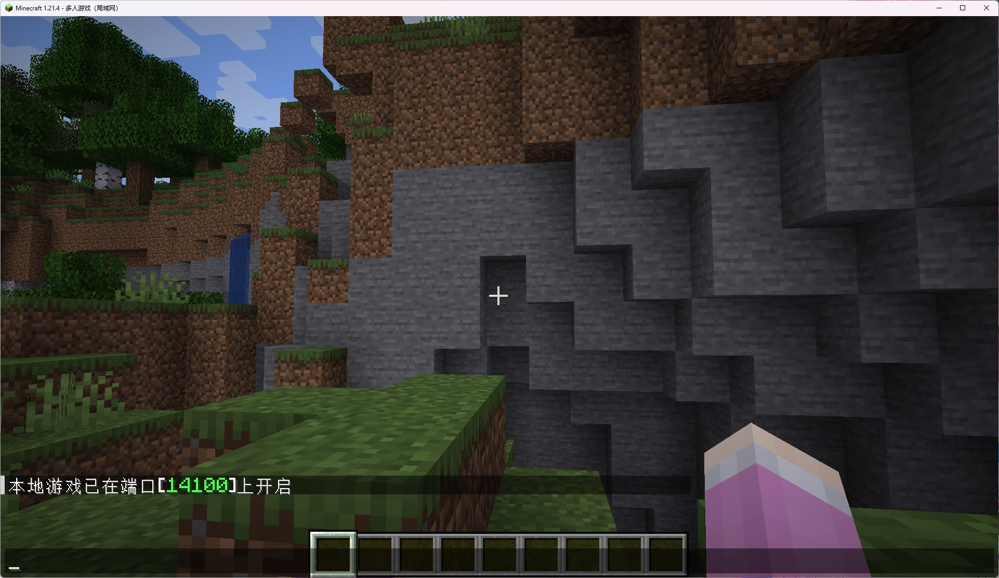
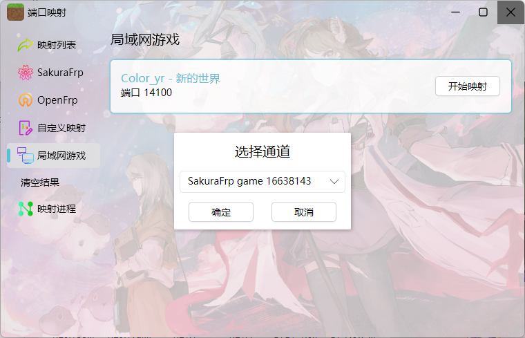
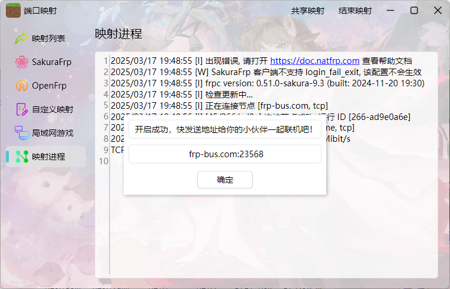
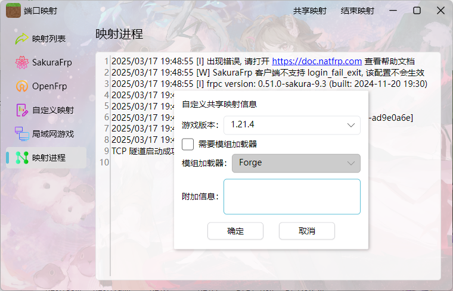
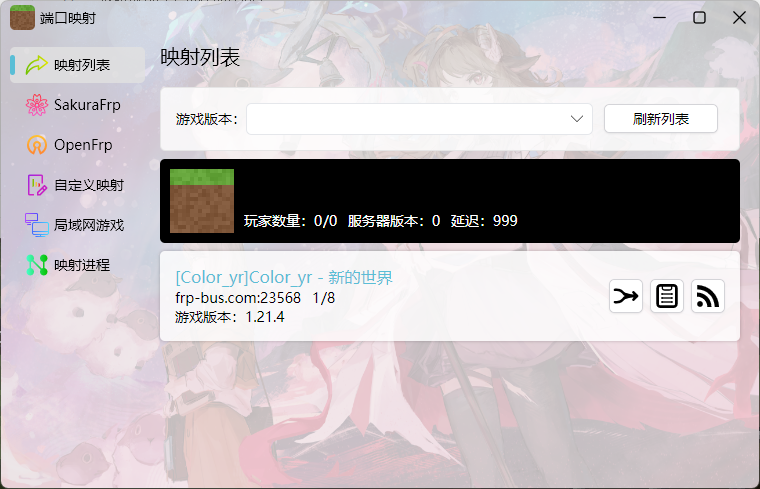
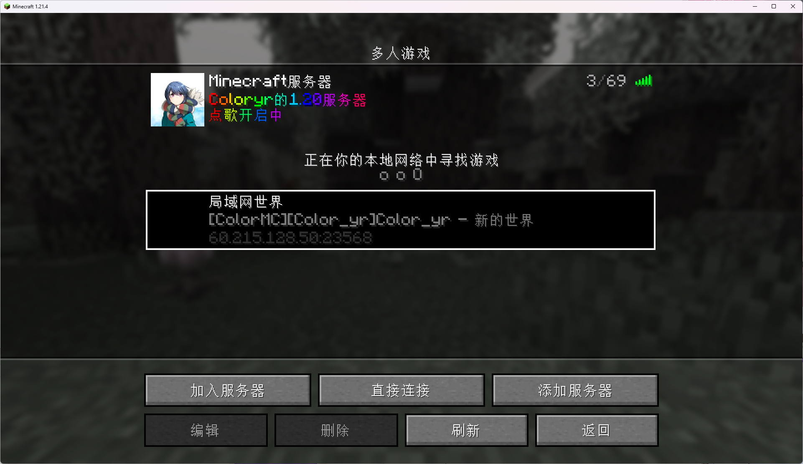

# 联机功能使用教程

**联机功能只允许正版用户使用**

1. 启动ColorMC启动器，登录一个正版账户  
登录后然后选择该正版账户  

2. 选择一个Frp  
我这里选择[Skaura Frp](https://www.natfrp.com/user/)  
注册并登录账户后  
新建一条TCP隧道，节点选择一个合适的  
  
然后回到[首页]，点击[复制密钥]  

3. 在主界面打开联机大厅  
  
在左侧栏选择`SkauraFrp`  
填写key，并刷新，此时可以看到隧道  
  

4. 启动游戏并开启局域网游戏  
  
回到启动器，选择`局域网游戏`  
找到你的局域网游戏，点击`开始映射`  
接着选择一个隧道  
  
等待初始化完成  
出现下面就成功映射了  
  

5. 分享映射并加入房间  
在`映射进程`下，点击右上角的`共享映射`  
  
共享完成后，让你的朋友选择`映射列表`  
此时就可以看见你的房间了  
  
如果以ColorMC启动器启动游戏，可以在多人游戏里面看到你的房间  

